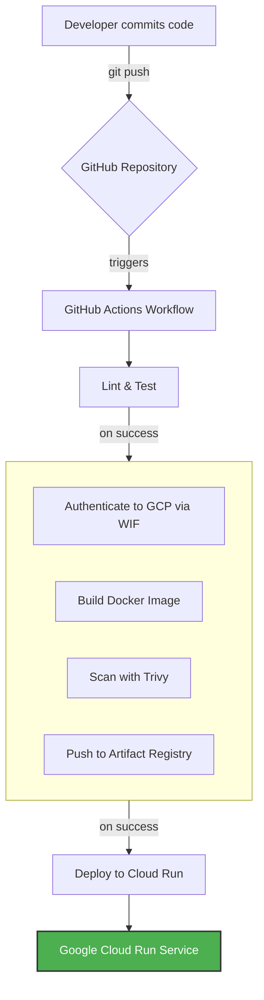

# Ruby on Rails on Cloud Run - Terraform Infrastructure

This directory contains all the Terraform code required to provision and manage the infrastructure for the JARVIS demo application on Google Cloud Platform.

The infrastructure is designed to be scalable, secure, and fully managed through code, with a complete CI/CD pipeline powered by GitHub Actions.

## Architecture Overview

This project provisions the following key components:

- **Google Cloud Run:** A serverless, fully managed environment to run our containerized Ruby on Rails application.
- **Google Artifact Registry:** A private Docker registry to store our application's container images.
- **Google IAM:** Manages Service Accounts and permissions, following the principle of least privilege.
- **Workload Identity Federation:** Provides a secure, keyless authentication mechanism for GitHub Actions to interact with GCP.

The deployment flow is fully automated:

1.  A developer pushes code to the `main` branch on GitHub.
2.  GitHub Actions triggers a workflow that runs tests, lints, and security scans.
3.  If CI checks pass, a new Docker image is built and pushed to Artifact Registry.
4.  Terraform is then executed by the workflow, which deploys the new image as a new revision on Cloud Run.



## Prerequisites

Before you begin, you must have the following installed and configured:

1.  **Terraform CLI:** [Installation Guide](https://learn.hashicorp.com/tutorials/terraform/install-cli) (version >= 1.5.0).
2.  **Google Cloud SDK (`gcloud`):** [Installation Guide](https://cloud.google.com/sdk/docs/install).

You will also need:

- A new Google Cloud Project with Billing enabled.
- A user account with the **`Owner`** role on that project. This is required **only for the initial one-time bootstrap** process.

## Initial Project Setup (One-Time Bootstrap)

This infrastructure uses a GCS bucket as a remote backend to store the Terraform state. This is crucial for collaboration and for CI/CD. The following process uses a "Two-Phase Bootstrap" to create the GCS bucket itself using Terraform.

**This entire setup process only needs to be performed once for the project's lifetime.**

### Phase 1: Create the GCS Backend with a Local State

In this phase, we will temporarily use a local state file to create the GCS bucket that will become our remote backend.

1.  **Configure Your Variables:**
    Create a file named `terraform.tfvars` in this directory and populate it with your project-specific values. **Do not commit this file to version control if it contains secrets.**

    ```tf
    # terraform.tfvars
    gcp_project_id = "your-gcp-project-id"
    github_repo    = "your-github-username/your-repo-name"
    ```

2.  **Add the GCS Bucket Resource:**
    Create a new file named `backend_infra.tf` and add the following code to define the state bucket. **Ensure the bucket name is globally unique.**

    ```terraform
    # terraform/backend_infra.tf
    resource "google_storage_bucket" "tfstate" {
      project      = var.gcp_project_id
      name         = "your-unique-bucket-name-for-tfstate" # <-- CHOOSE A GLOBALLY UNIQUE NAME
      location     = var.gcp_region
      storage_class = "STANDARD"

      lifecycle {
        prevent_destroy = true
      }
      versioning {
        enabled = true
      }
    }
    ```

3.  **Temporarily Disable the Remote Backend:**
    Create a `backend.tf` file. For this initial step, its contents should be **commented out**.

    ```terraform
    # terraform/backend.tf
    # terraform {
    #   backend "gcs" {
    #     bucket = "your-unique-bucket-name-for-tfstate" # <-- Use the same name from backend_infra.tf
    #     prefix = "terraform/state"
    #   }
    # }
    ```

4.  **Authenticate and Apply:**
    Authenticate your local machine as the privileged user.

    ```bash
    gcloud auth application-default login
    ```

    Now, initialize and apply. This will create all infrastructure, including the GCS bucket, and store the state in a local `terraform.tfstate` file.

    ```bash
    terraform init
    terraform apply -auto-approve
    ```

### Phase 2: Migrate to the GCS Remote Backend

Now that the GCS bucket exists, we will migrate our local state into it.

1.  **Re-enable the Remote Backend:**
    Uncomment the code in `terraform/backend.tf`.

2.  **Re-initialize and Migrate:**
    Run `terraform init` again. Terraform will detect the change and prompt you to migrate your state.

    ```bash
    terraform init
    ```

    When prompted `Do you want to copy existing state to the new backend?`, type **`yes`** and press Enter.

Your Terraform state is now securely stored in the GCS bucket.

## GitHub Actions CI/CD Configuration

The final step is to provide the CI/CD pipeline with the necessary credentials by adding secrets to your GitHub repository.

1.  **Retrieve Terraform Outputs:**
    Run the following command to get the values you will need for the secrets:

    ```bash
    terraform output
    ```

2.  **Add Secrets to GitHub:**
    In your GitHub repository, go to **Settings > Secrets and variables > Actions** and add the following repository secrets:

| Secret Name                      | Value                                                                                 |
| :------------------------------- | :------------------------------------------------------------------------------------ |
| `GCP_PROJECT_ID`                 | The ID of your GCP project (e.g., `devops-469009`).                                   |
| `GCP_WORKLOAD_IDENTITY_PROVIDER` | The full name of the provider from the `workload_identity_provider` Terraform output. |
| `GCP_SERVICE_ACCOUNT`            | The email address from the `github_actions_sa_email` Terraform output.                |
| `RAILS_MASTER_KEY`                | Rails encryption key for credentials                                                  |

## Day-to-Day Infrastructure Management

With the setup complete, all subsequent deployments are handled automatically by the CI/CD pipeline when code is pushed to the `main` branch.

To make manual infrastructure changes:

1.  Modify the relevant `.tf` files.
2.  Run `terraform plan` to preview the changes.
3.  Run `terraform apply` to implement the changes.

## File Structure

- `main.tf`: Defines the core application resources (Cloud Run, Artifact Registry).
- `iam.tf`: Defines all IAM resources (Service Accounts, Workload Identity Federation, permissions).
- `variables.tf`: Declares all input variables for the configuration.
- `outputs.tf`: Declares the output values from our infrastructure.
- `versions.tf`: Pins the required versions of Terraform and the Google Cloud provider.
- `backend.tf`: Configures the GCS remote state backend.
- `backend_infra.tf`: Defines the GCS bucket used for the remote state.
